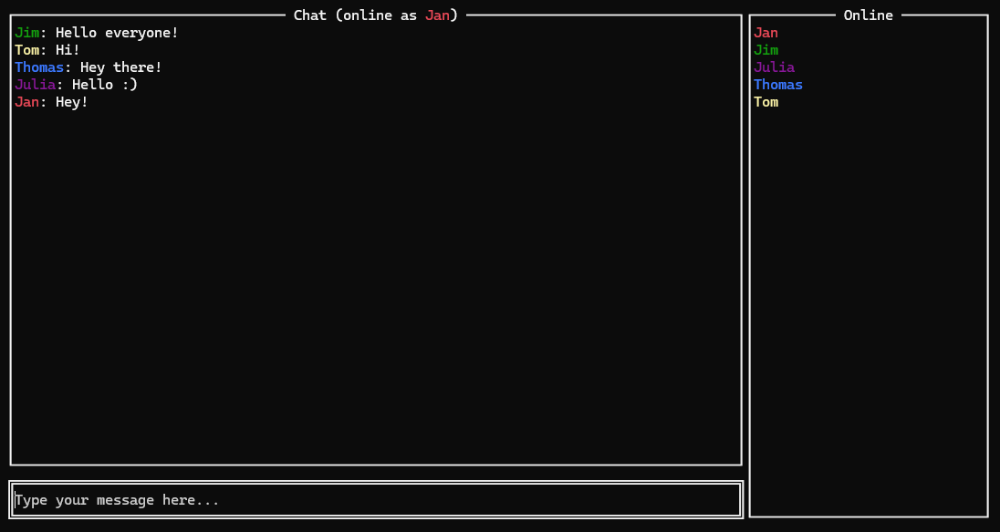

# Multi User Terminal Chat
This is a multi user chat app, providing a program for both the server and the corresponding client.
The client is implemented for the terminal and uses terminal UI. I provide a sample screenshot below:

# Build
From the root directory run:

Build server:
`go build -o ./bin/chat_server.exe ./server`

Build client:
`go build -o ./bin/chat_client.exe ./client`

# Further Instructions
After building the executables run the server from the root directory with `./bin/chat_server`. It will prompt you to enter a port you want to start the server on (and provides a default port).
Then run the client executable directly in the terminal (after building available as `./bin/chat_client`) on any computer you want to connect to the server with.